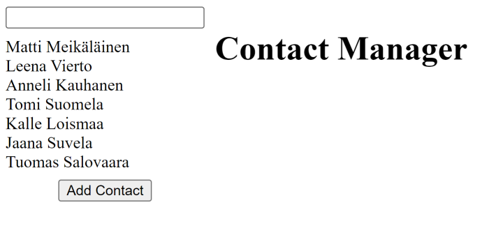
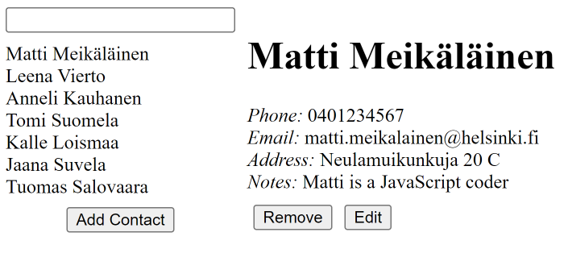
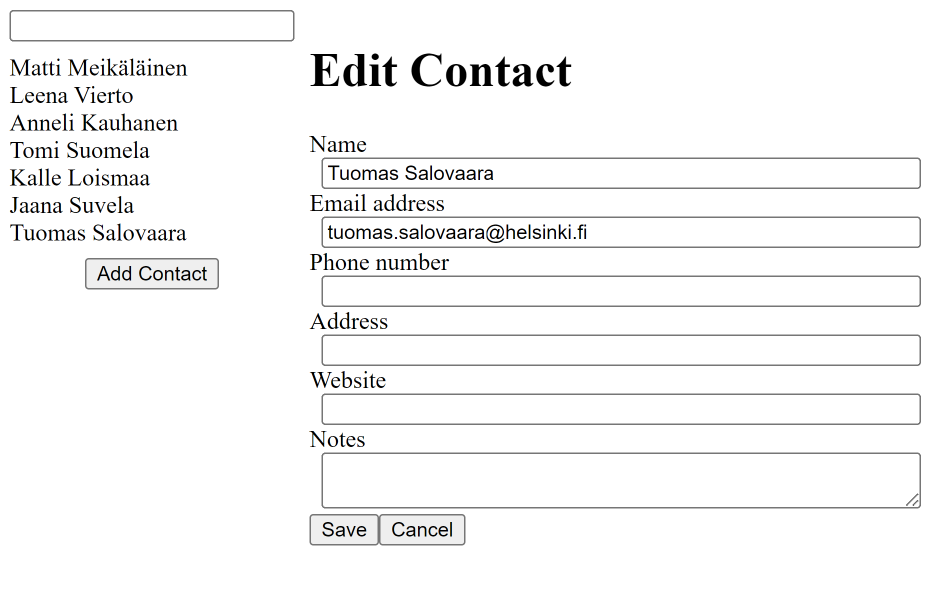
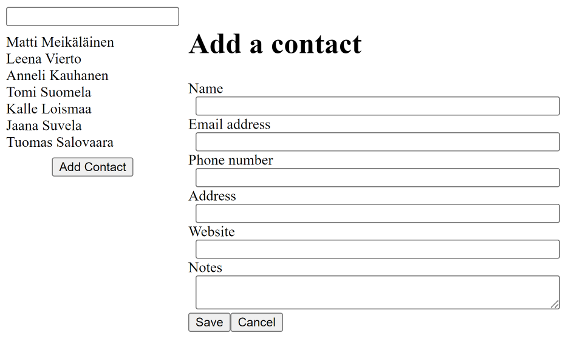
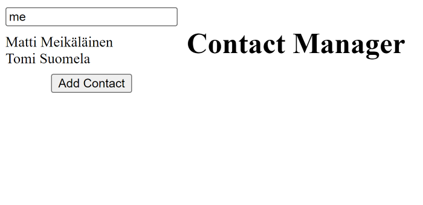

# Assignments for Lecture 16

## Assignment 16.1: A Simple ToDo List

Armed with the knowledge of how to use states, inputs, and lists, create a ToDo list app. It should have
- A text input where user can type a todo item
- A button that adds the item to the todo list
- The todo list that gets re-rendered when a new item is added

**Bonus**: Add a feature where you can remove items from the list by clicking on them.
**Extra Bonus**: Add a style file and make the list app pretty.

## Assignment 16.2: Timer

Using `useState()`, `useEffect()` and `setTimeout()`, create a timer that updates every second.
**Bonus 1**: Add a button that resets the timer to 0
**Bonus 2**: Add minutes to the timer and update them every 60 seconds
**Bonus 3**: Add buttons to add 1 minute or 1 second to the timer and also a button to start/stop it

## Assignment 16.3: Bingo

Your grandma wants to practice her bingo game to top level and wants you to build an app for practice
Program a React application with a button that adds a new random bingo number to the screen every time the button is pressed.

**Hint**: The bingo numbers should be stored in an array that is the value of the state.
**Extra**: Make it impossible to get the same number twice, Make your bingo balls pretty and create a reset button.

## Assignment 16.4: Feedback

Create a feedback form. The form should have a **radio button** selection of the type of the feedback (feedback/suggestion/question), a **textarea** for the actual feedback, and **input fields** for first name, last name and email address.
There should also be **buttons** for sending and resetting the form.
**Extra**: The send button should be **disabled** if none of the radio buttons is selected or if the textarea is empty.

<!-- Homework Assignments -->

## Assignment 16.5: More Cats

Create a Cat App using https://cataas.com/ API. The app should have three elements: a cat pic, text input, and a reload button. 

The app should open with a random cat pic and an empty input. If the reload is pressed when the input is empty, it should load another random cat pic.

If there is text in the input and the reload is pressed, it should load a new random cat picture with the text rendered into the picture.

## Assignment 16.6: Contact List

Create a contact list app. The app should have a two column layout. The left column should have a list of all the contacts. 

There should be an "Add contact" button in the left column. When user clicks that, a view to add new contact is shown in the right column. The view should have fields name, email, phone, address, website, and info. In addition there should be buttons save and cancel. If user clicks cancel, the app returns to the starting state. If the user clicks save, the contat is added to the list of contacts.

If user clicks one of the contacts from the left column, contact details are shown in the right column. Only saved information is shown, no empty fields should be visible. There should also be buttons edit and remove. If the user clicks remove, the contact is removed and the app returns to the starting state. If the user clicks edit, a contact editor opens in the right column. 

There should be a search box in the left column. If the user types a partial name to the search box, the list of contacts is reduced to include only the contacts whose name include the search term.

## EXTRA Assignment 16.7: Calculator

Create a calculator using React. Make your calculator pretty.