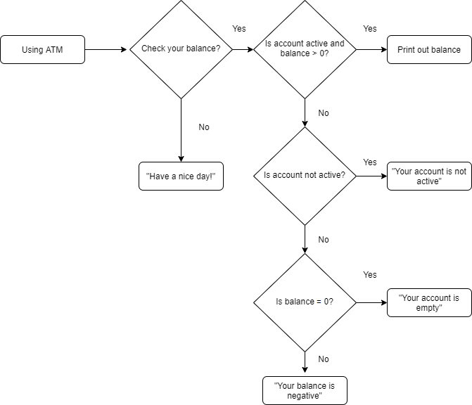

# Assignments for Lecture 2


<!-- Lecture Assignments -->

## Assignment 2.1: Using ESLint

Create an empty project and install **ESLint** there. Add this code to the folder and use ESLint to fix it!
```
var foo = 1
console.log(foo)
const bar
bar = 1
function test(


    ) {
  console.log(baz)
}
var baz = 123
```


## Assignment 2.2: Adding a Rule
Add following rule to .eslintrc.json
```
"no-var": "error"
```

Save the file and fix the ESLint issues


## Assignment 2.3: Working with Arrays
```
const arr = ["banaani", "omena", "mandariini", "appelsiini", "kurkku", "tomaatti", "peruna"]
```

1. Print the 3rd and 5th items of the array and the array’s length
2. Then sort the array in alphabetical order and print the entire array
3. Finally, add the item “sipuli” to the array, and print out again

**EXTRA:**

4. Remove the first item in the array, and print out again. HINT: shift()
5. Print out every item in this array using .forEach()
6. Print out every item that contains the letter ‘r’. HINT: includes()


## Assignment 2.4: Using the For Loop

Using the for loop for each problem, print out the following number sequences:

1. 0 100 200 300 400 500 600 700 800 900 1000
2. 1 2 4 8 16 32 64 128
3. 3 6 9 12 15
4. 9 8 7 6 5 4 3 2 1 0
5. 1 1 1 2 2 2 3 3 3 4 4 4
6. 0 1 2 3 4 0 1 2 3 4 0 1 2 3 4


## Assignment 2.5: Sum of Ints

Write a program that prints the **sum of integers from 1 to n**, with a given number n. For example, if n = 5, program prints 15.

Solve this task with **both** a *for loop* and a *while loop*.


## Assignment 2.6: Sum of Some Ints

Modify the previous program so that only the multiples of **three and five** are considered in the sum. For example: if n=17, we’d accept 3, 5, 6, 9, 10, 12 and 15, and the sum would be 60.

**Hint**: The modulus operator will help you with this.

## Assignment 2.7: FizzBuzz

Create a program that **loops through numbers from 1 to 100** and
- if the number is **divisible by 3**, prints "Fizz"
- if the number is **divisible by 5**, prints "Buzz"
- if the number is **divisible by both** (3 and 5), prints "FizzBuzz"
- if no previous conditions apply, prints just the number


## Assignment 2.8: Triangles

Create a program that takes in a number n and prints out a triangle of &’s with the height of n. 

**Level 1**: if n = 4, program prints
```
&
&&
&&&
&&&&
```
**Level 2**: if n = 4, program prints
```
   &
  &&&
 &&&&&
&&&&&&&
```
**Level 3**: Complete the same task using some other loop variant than what you originally used. E.g. if you solved this using for loops, now solve it using while loops.


## Assignment 2.9: The Largest Number
```
const arr = [1, 4, 6, 32, 25, 16, 31, 15, 10, 2, 7]
```

Print out the **largest number** found in this array.

Do this *without* first sorting the array, and *without* using Math.max() function.

**Extra**: Find the **2nd largest** number in the array, again without sorting the array first, or using Math functions to aid you.


## Assignment 2.10: Student Grades
```
const students = [
    { name: 'Markku', score: 99 },
    { name: 'Karoliina', score: 58 },
    { name: 'Susanna', score: 69 },
    { name: 'Benjamin', score: 77 },
    { name: 'Isak', score: 49 },
    { name: 'Liisa', score: 89 },
]
```
1. Find the highest, and the lowest scoring people.
2. Find the average score of the students
3. Print out only the students that scored higher than the average
4. Assign grades (1-5) to all students based on their scores
    - 1: 1-39
    - 2: 40-59
    - 3: 60-79
    - 4: 80-94
    - 5: 95-100


## Assignment 2.11: Creating a Git Repository

Create a **new repository in GitLab** and clone it using ssh key to your machine.

Then, create a new **README.md** file with some text in it in the repository. (You can use code from earlier exercises you’ve done or are working on at the moment!)

**Add** it, **commit** it, and **push** it to Git. Go to GitLab and see that the file is there!


## Assignment 2.12: Merge Request

Create a **new branch** (with a name dev, for instance) in your new Git repository. **Checkout** the branch, make some changes to main.js there, and **push the changes** to GitLab.

Then, create a **merge request** from dev branch to master branch by using gitlab button or remote url.

Finally, **approve** the merge request in GitLab.


<!-- Homework Assignments -->

## Assignment 2.13: Hello World, part 2
Create a program that takes in one argument from command line, a language code (e.g. "fi", "es", "en"). Console.log "Hello World" for the given language for atleast three languages. It should default to console.log "Hello World". 

Remember to test that the program outputs the right answer in all cases.
* Hint: use process.argv for input


## Assignment 2.14: Greater, smaller or equal
1. Create a program that takes in two numbers a and b from the command line.
2. Print out "a is greater" if a is bigger than b, and vice versa, and "they are equal" if they are equal
3. Modify program to take in a third string argument c, and print out "yay, you guessed the password", if a and b are equal AND c is "hello world"

Remember to test that the program outputs the right answer in all cases.


## Assignment 2.15 Largest and smallest
From the command line read in three numbers, number1, number2 and number3. Decide their values freely.

Find the  
a) largest one  
b) smallest one  
c) if they all are equal, print that out  

console.log() its name and value.


## Assignment 2.16 How many days
Create a program that takes in a number from commandline that represents month of the year. Use ``console.log`` to show how many days there are in the given month number.


## Assignment 2.17 ATM
Create a ATM program to check your balance. Create variables ``balance``, ``isActive``, ``checkBalance``. Write conditional statement that implements the flowchart below.



Change the values of `balance`, `checkBalance`, and `isActive` to test your code! 


## Assignment 2.18 Initial letters
Create a program that takes in 3 names and outputs only initial letters of those name separated with dot.

example: ``node .\initialLetters.js Jack Jake Mike`` -> ``j.j.m``
1.11 String length comparison
Create a program that takes in 3 names, and compares the length of those names. Print out the names ordered so that the longest name is first.

example: ``node .\lengthcomparison.js Maria Joe Philippa`` -> ``Philippa Maria Joe``


## Assignment 2.19: Modify case
Create a program that takes in a string, and modifies the every letter of that string to upper case or lower case, depending on the input

example: ``node .\modifycase.js lower "Do you LIKE Snowmen?"`` -> ``do you like snowmen``

example: ``node .\modifycase.js upper "Do you LIKE Snowmen?"`` -> ``DO YOU LIKE SNOWMEN``

**NOTE** remember to take in the 2nd parameter with quotation marks


## Assignment 2.20: Annoying substring
Create a program that takes in a string and drops off the last word of any given string, and console.logs it out.

example: ``node .\annoyingSubstring.js "Hey I'm alive!"`` -> ``Hey I'm`` 
1.14 Replace characters (difficult)
Create a program that takes in a string, and replaces every occurrence of your given character with your other given character.

example: ``node .\replacecharacters.js g h "I have great grades for my grading"`` -> ``I have hreat hrades for my hrading``

* Hint: https://www.w3schools.com/jsref/jsref_replace.asp
