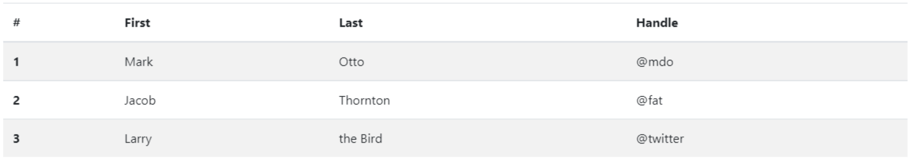
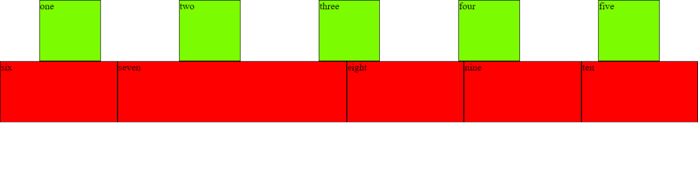
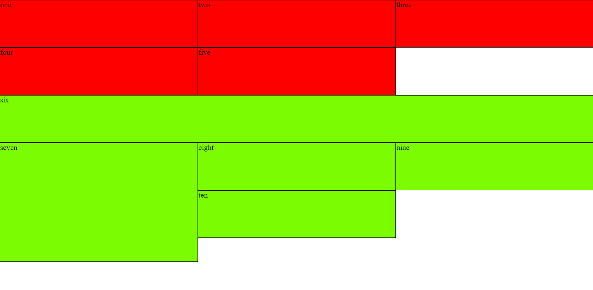
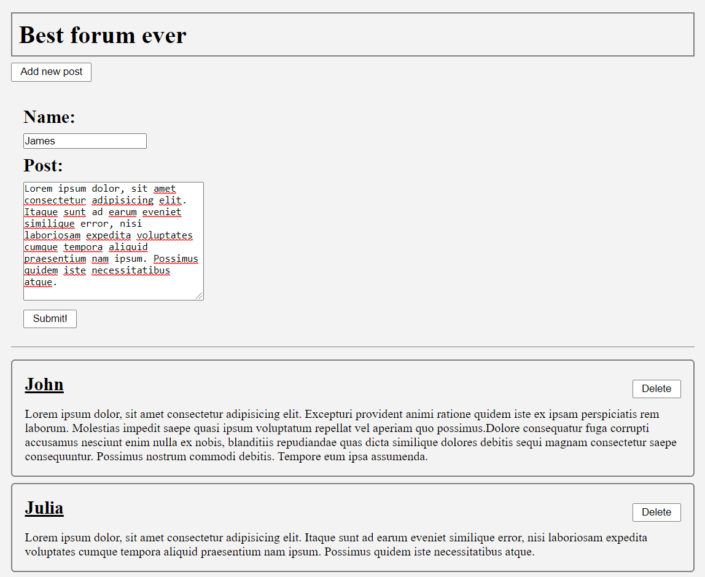
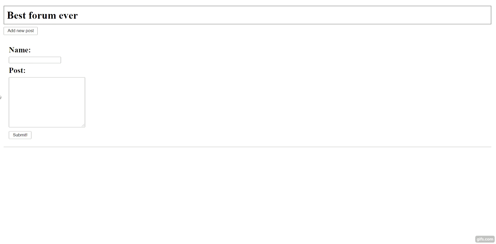

# Assignments for Lecture 5

<!-- Lecture Assignments -->

## Assignment 5.1: A Simple Website

Make a simple **HTML website** using the template from the previous slide, so that it contains **paragraphs**, **headings**, **images** and **links**. Add at least one **divisor** that contains at least two sub-level items (like an image and a paragraph).

Add at least two links; one **remote** and one **local**. How would you make an image to be a link?

Give your page a **title**.

Later on, we will add more stuff to the site.

## Assignment 5.2: Forms

1. Add a login form to your website that asks username and password
2. Add a radio input  for choosing whether the user is logging in as an admin or not

## Assignment 5.3: Table

Add a table with a header and numbered entries. The visual style doesn’t need to match the below example, but make it structurally similar

## Assignment 5.4: ID's and Classes

Create a **style sheet** named *style.css* and link it to the page you created. Then add following features
1. Create a `
` element with some content (like a `
` element) inside of it. Give the div a class that gives it a yellow background color.
2. Create another `
` element with some content. Give it an ID that gives its contents red text color.

## Assignment 5.5: Paddings and Margin

The page that we’ve previously modified should have an image in it. Add another image below the div elements created in the previous assignment.Apply CSS that gives all images on the page the following properties
1. padding: 0.5em
2. margin: 1em on the right and left, 0.5em on the top and bottom
3. a blue background color so you can better see how the padding and margin works

## Assignment 5.6: Lists and Children

Create a new `<ul>` list element with at least 5 `<li>` items to your page.

Then, in your *style.css*, add a CSS style that changes the **text color** of every odd-number-indexed list element to purple.

**Hint**: *nth-child* allows specifying odd instead of even for styling odd-indexed children.

## Assignment 5.7: Greeting the User

Create a new **script file** and link it to your page. Make your page greet the user by writing a welcome message to the console when the page is loaded.

Unlike with Node.js in the back-end, the console is not directly visible to the user in the browser. You’ll need to open your browser’s developer tools to view the console in your browser and see the message.

## Assignment 5.8: Counter

Add a **button** to your page. Add an **event handler** function to the button that uses the *window.alert* method to tell the user how many times they’ve clicked on the button so far.

See https://developer.mozilla.org/en-US/docs/Web/API/Window/alert

For example, on first press the user should see a message box saying “Clicked 1 time(s)”, on second press it should say “Clicked 2 time(s)”, and so on.

**Note**: avoid using window.alert as it’s generally not great for the user experience. But here it’s fine for educational purposes.

<!-- Homework Assignments -->

## Assignment 5.9: CSS Flexbox

Create the following looking page using **flexbox**.
**Extra**: create same layout using Bootstrap.

https://css-tricks.com/snippets/css/a-guide-to-flexbox/
https://getbootstrap.com/docs/4.0/utilities/flex/

## Assignment 5.10: CSS Grid

Create the following looking page using **grid**.
**Extra**: create same layout using Bootstrap.

https://css-tricks.com/snippets/css/complete-guide-grid/
https://getbootstrap.com/docs/4.0/layout/grid/

## Assignment 5.11: Forum Page

Create a forum page which has the following functionalities:
- Some kind of a header (no special functionalities needed for this)
- Two input fields:
    - One for user’s name
    - One for user’s post
- A submit button
    - When the user clicks this, the name and the post will be posted to the page
- Toggle button
    - Create a button that hides the form when clicked and shows the form when clicked again
- Delete button for posts
    - Add a button to a forum post that removes it
- Alert an error message if name or post are empty when submitting

The page should look something like this:

Functionalities:

