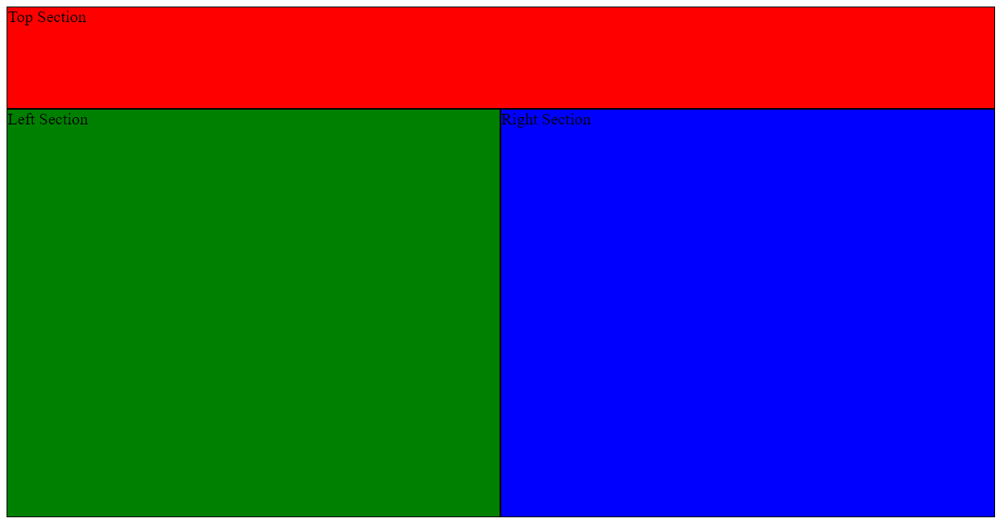

# Assignments for Lecture 6


<!-- Lecture Assignments -->

## Assignment 6.1: Jokes

Create a website that displays jokes. The page should have a header, a button, and a div containing a joke. Whenever the button is pressed, the joke in the div is replaced by a new joke. 

You can use the jokes array found from ... 

## Assignment 6.2: Change Style on Hover

Create a page with layout as below. Make each section change color to yellow when mouse cursor is hovered over it.



## Assignment 6.3: Tic Tac Toe

Create a page where you can play Tic Tac Toe. The page should have nine square div's in 3x3 grid. When one of the divs is clicked, the square is filled with an 'X'. When next square is clicked, it is filled with an 'O'. If a square with either X or O already in it is clicked, nothing happens. 

You don't need to worry about victory conditions.

**Extra**: Add three buttons to the page:  **reset**, **+**, and **-**. The reset button should reset the board. The plus button should *increase* the board size by one, and reset the board. The minus button should *decrease* the board size by one, and reset the board. The board size should not be able to go below three. That would be silly.


<!-- Homework Assignments -->


## Assignment 6.4: Formatting
You have a page with a paragraph as below.

```
<p>
Lorem ipsum dolor sit amet, consectetur adipiscing elit. Sed eget tortor sagittis, mattis quam at, feugiat risus. Cras vitae tellus rhoncus, semper mi eget, sollicitudin odio. Donec eget mattis magna. Pellentesque faucibus risus eu nisl convallis condimentum. Fusce enim libero, malesuada commodo erat eget, volutpat eleifend ipsum. Curabitur maximus bibendum nisl ac volutpat. Phasellus ultricies eleifend enim non convallis. Sed et orci convallis, porta risus porta, maximus orci. Quisque placerat ante elit, nec commodo lorem congue ut. Mauris magna ex, aliquet nec laoreet sed, vulputate vel mauris. Praesent dictum scelerisque lacus, sed eleifend felis efficitur quis. Maecenas malesuada id tortor vel tempor. Vivamus sodales, sapien a vehicula blandit, odio tortor dapibus tellus, vitae bibendum tellus ex faucibus nunc. Etiam a mi consequat nunc aliquet lobortis.
<p>
```
Write a script that
1. Divides each sentence into a separate paragraph.
2. Highlights all words longer than 6 letters in yellow color.
3. Removes the original paragraph (so that there is no duplicate text)


## Assignment 6.5: Text analyzer

Create a page for analyzing text. The page should have a **textarea**, where user can input text, and a **button** that starts the analyzing process. There should also be an element in the page where the results will be displayed. The analyzer should find out 
- how many times each word appears in the text
- total word count
- average length of the words

Test that your analyzer can handle big texts, like [Moby Dick](https://www.gutenberg.org/files/2701/2701-0.txt)


**Extra 1**: Sort the results so that the most frequently used words appear on top. 
**Extra 2**: Ignore punctuation and capitalization in the analysis.

## Assignment 6.6: ToDo List

Create a todo list page. 

- Version 1: The page should have an input field, and when user presses enter, the field value is added to the list of todo items, and the input is cleared.
    - Hint: *onkeypress* events and *event.key* will help you.
- Version 2: Clicking a todo item marks it done, ie the text will go gray and will get a striketrhough. Clicking it again, will mark it undone.
    - Hint: *classList.toggle*
- Version 3: Add a button that removes **all the done items** from the list.


## Assignment 6.7: Sliding Tile Puzzle (Hard)

[A sliding tile puzzle](https://en.wikipedia.org/wiki/Sliding_puzzle) is the kind of puzzle where you have a grid of pieces, with one piece missing. You can move any piece up, down, or sideways to the place of the missing piece. The goal is to arrange the tiles in order. 

An example of a sliding tile puzzle can be found [here](https://www.helpfulgames.com/subjects/brain-training/sliding-puzzle.html)

**Crete a 4x4 sliding tile puzzle**. The game should have 16 squares with numbers 1-15 in them, plus the empty square. Every time the player clicks a square, the game should check if the piece is one of the pieces that can be moved. If so, the game swaps the clicked square and the empty square. If not, nothing happens.

After each click the game should check if the tiles are in order. If so, the game ends and the empty slot is replaced by number 16. A message telling that the player has finished the game appears to the screen.

**Extra**: Replace the numbers in the game with a grid of pictures. You can use an external service, like [postcron.com](https://postcron.com/image-splitter/editor/en/upload-image) to create a grid of images. When the game finishes, the missing tile should be replaced with the remaining image piece.