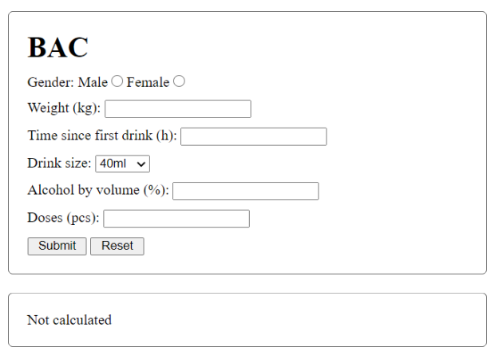
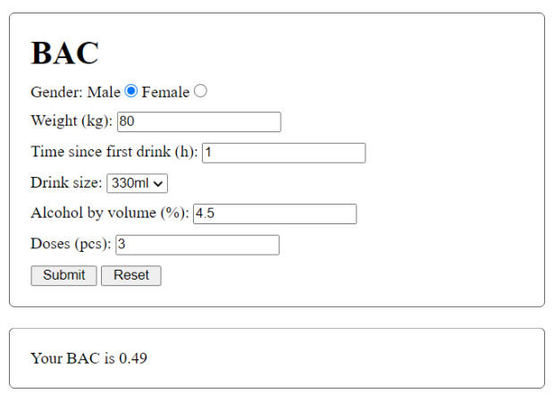
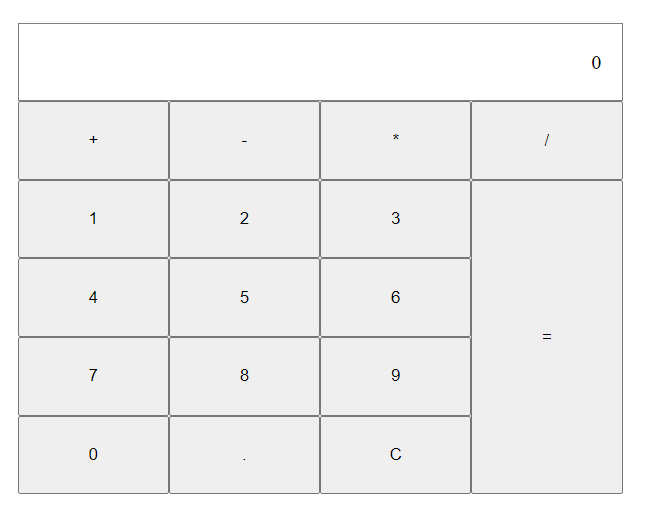
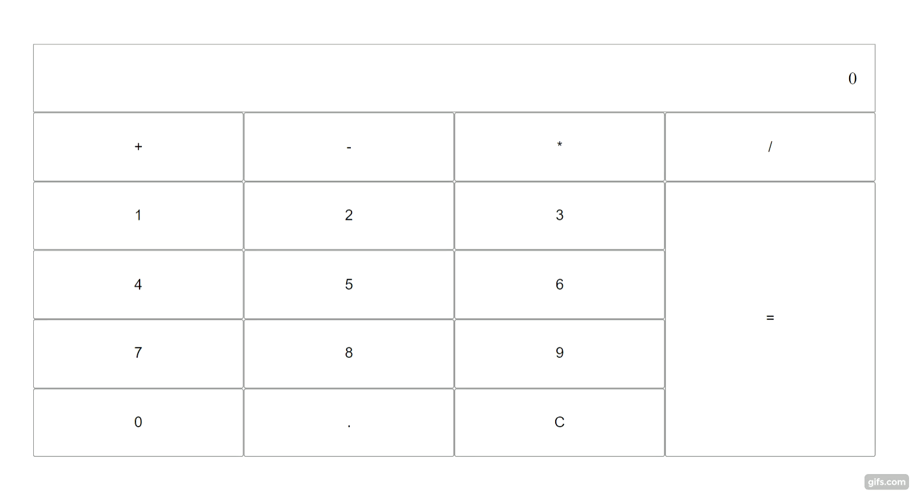
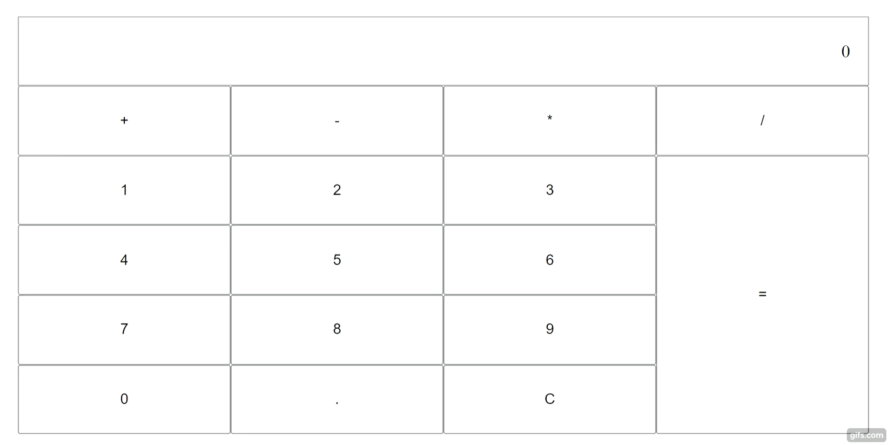

# Assignments for Lecture 7


<!-- Lecture Assignments -->

## Assignment 7.1: Countdown to Start (Callbacks)

Create a countdown program using the *setTimeout* function and **callbacks**.

The program should output something like this.

3       ⇒ Wait 1 second
..2     ⇒ Wait another second
....1    ⇒ Wait the last 1 second..
GO!


## Assignment 7.2: Countdown to Start (Promises)

Create a countdown program using the *setTimeout* function and **promises**.

The program should output something like this.

3       ⇒ Wait 1 second
..2     ⇒ Wait another second
....1    ⇒ Wait the last 1 second..
GO!


## Assignment 7.3: Async

Use the following asynchronous function twice to get 2 random values
```javascript
const getValue = function () {
    return new Promise((resolve, reject) => {
        setTimeout(() => {
            resolve({ value: Math.random() })
        }, Math.random() * 1500)
    })
}
```
console.log() the two resulting values:
```javascript
console.log(`Value 1 is ${valueOneHere} and value 2 is ${valueTwoHere}`);
```
Do this exercise **twice**. First time, use async & await, and on the second time use promise.then().


## Assignment 7.4: Sending API Requests

Install [Postman](https://www.postman.com), [Insomnia](https://insomnia.rest/products/insomnia), or [Rest Client](https://marketplace.visualstudio.com/items?itemName=humao.rest-client) (VSC Extension). Send some request to [Cat as a service API](https://cataas.com/)
- Get a picture of a random cat
- Get a picture of a cat saying "I can haz JavaScript"
- Get a JSON list of 20 cat pics

**Bonus**: Do the same thing using *curl* command line tool.


## Assignment 7.5 Consume API

Create a movie search page that uses [Open Movie Database API](https://www.omdbapi.com). The page should have a text input for the movie name, number input for the movie year, and a submit button.

When user submits a movie search, the page consumes OMDb API to get a list of results. The results should be rendered to the page as a list containing the movie name, release year, and a link to the relevant IMDB page.

You can use apiKey `c3a0092f`. No need to make the pagination work, just render the first ten results that the API provides by default. 

**Hint**: IMDB links are of the form `https://www.imdb.com/title/<imdbID>/`


<!-- Homework Assignments -->


## Assignment 7.6: Todos

Use the axios library (or fetch) to fetch data from ‘https://jsonplaceholder.typicode.com/todos/’
1. Console log out that data
2. Modify the existing data by also fetching the user from ‘https://jsonplaceholder.typicode.com/users/${userId}’ and adding it to the post where the userId is from, and remove the userId from that data item
3. Modify in the resulting array of objects the ‘user’ field of every object to only contain the fields ‘name’, ‘username’, and ‘email’.
5. Modify the functionality so that you separately fetch all users from 'https://jsonplaceholder.typicode.com/users/' and all todos from 'https://jsonplaceholder.typicode.com/todos/', and solve the tasks 2-4 by using only the data from the two arrays you fetched, effectively reducing the amount of requests to the API to 2.

Example of data object array after task 2
```javascript
[
...
  {
    userId: 3,
    id: 41,
    title: 'aliquid amet impedit consequatur aspernatur placeat eaque fugiat suscipit',
    completed: false,
    user: {
      id: 3,
      name: 'Clementine Bauch',
      username: 'Samantha',
      email: 'Nathan@yesenia.net',
      address: [Object],
      phone: '1-463-123-4447',
      website: 'ramiro.info',
      company: [Object]
    }
  },
  ...
]
```

and after task 4:
```javascript
[
...
  {
    userId: 3,
    id: 41,
    title: 'aliquid amet impedit consequatur aspernatur placeat eaque fugiat suscipit',
    completed: false,
    user: {
      name: 'Clementine Bauch',
      username: 'Samantha',
      email: 'Nathan@yesenia.net',
    }
  },
  ...
]
```


## Assignment 7.7: BAC

Create application to calculate and display the blood alcohol content from user inputs.  

You can use the formula below to calculate blood alcohol content (BAC) (if you know a better formula to calculate BAC, please feel free to use it).  

**Formula**:  
**litres**: drink size * doses (converted to litres)  
**grams**: litres * 8 * alcohol by volume  
**burning**: weight / 10  
**grams left**: grams – (burning * time since first drink)  
**result (for male)**: grams left / (weight * 0.7)  
**result (for female)**: grams left / (weight * 0.6)  

Validate that the types of given values are cprrect.  

Add reset button to clear inputs  

**Drink size dropdown options:** 40ml, 80ml, 330ml, 500ml, 750ml  

**Extra**: add some styles to app  





## Assignment 7.8: Calculator

Create a calculator app.

The calculator must be able to calculate additions, subtractions,	multiplications and divisions.  
It should be able to calculate simple mathematics with 2 numbers.  
**EXTRA:** Make it be able to calculate an arbitrary number of numbers, following the basic rules of mathematics. 

If the user enters another operator sign after an operator, it should replace the previous operator sign.

**Validate that**:  
  * user can't enter more than one decimal point after another  
  * user can't enter decimal point if digit already has a decimal (1.1.)  
  * user can't enter decimal point after operator sign  

Clicking button "C" clears the display back to zero.





You can use the provided html and css files as a base for the calculator (available in Gitlab), however, we encourage you to try and implement your own solution for html and css. If you choose to use the available html and css files, add some styling of your own.